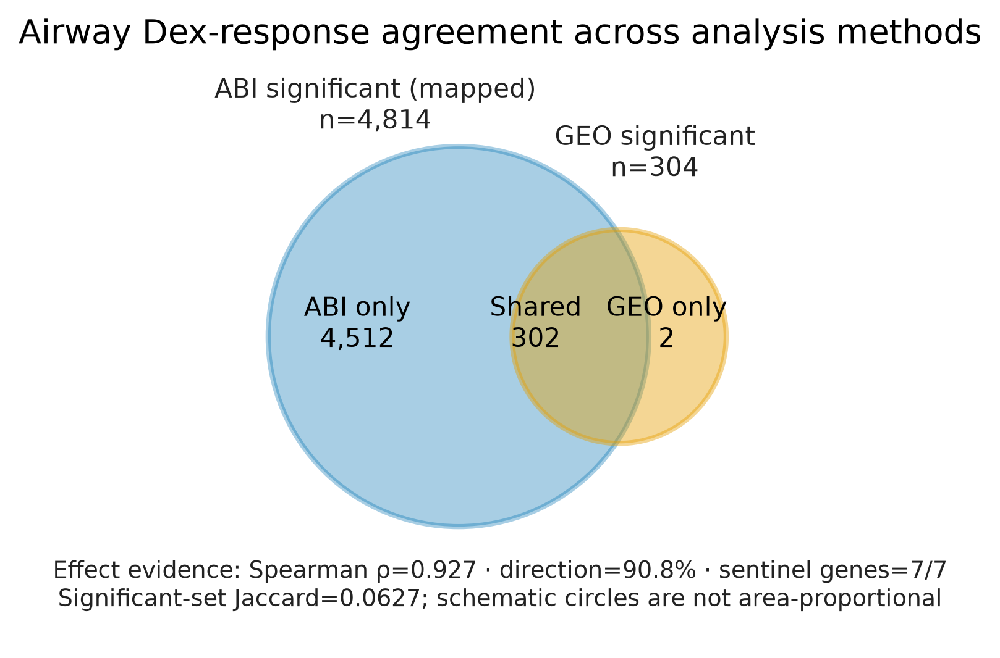
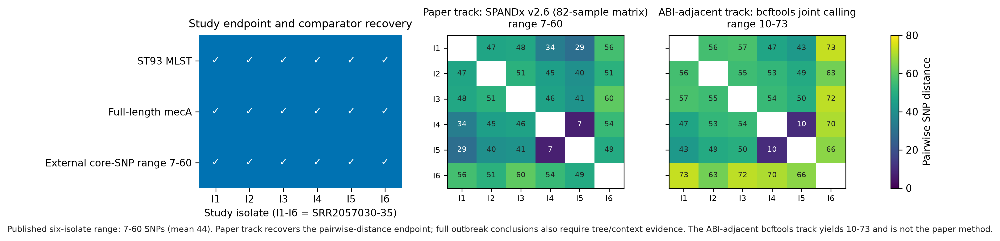
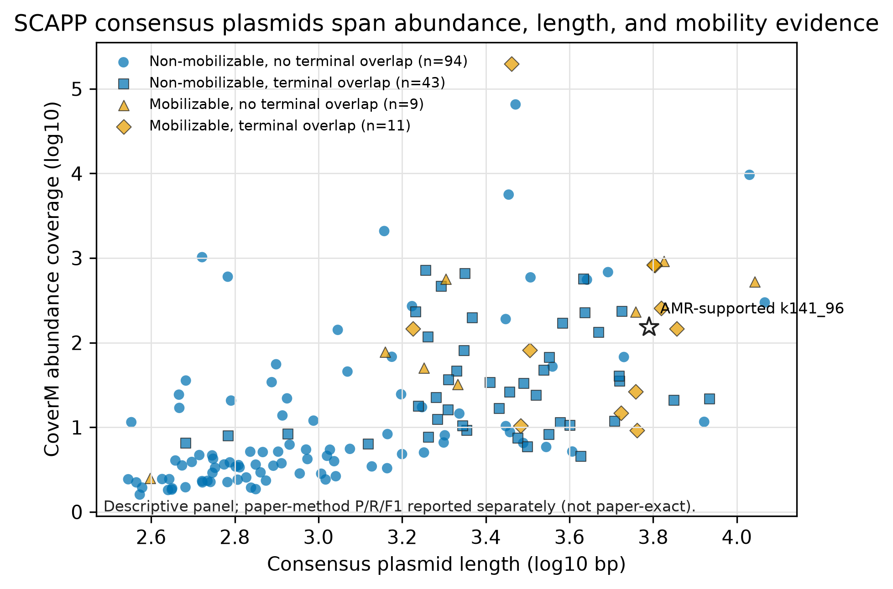

# Airway 与 WGS：配对真实数据例子

本例说明 ABI 所说的“契约驱动生物信息执行”。Airway RNA-seq 与细菌 WGS 使用相同的
Agent 生命周期，但并不共享一个泛化的生物学 pipeline。每个插件分别保留研究设计、工具、资源、
预期输出、科学端点和限制。

```text
生物学目标 -> ABI 插件契约
                 |-- Airway -> STAR -> featureCounts -> DESeq2
                 |              `-> 排名 + 方向 + sentinel evidence
                 `-- WGS ----> fastp -> SPAdes -> Prokka -> MLST -> AMRFinderPlus
                                `-> ST93 + mecA evidence
两条路径 -> 标准表 + 溯源 + 限制
```

YAML 配置与 `pipeline_dag.yaml` 使请求的工作流可检查；ABI 核心随后验证输入、资源、环境、
权限、步骤契约、输出和溯源。三者不能混淆：有效 DAG 是计划，经过验证的结果目录是执行证据，
与预注册端点的比较才是生物学证据。

## 统一操作生命周期

两种分析都遵循同一控制序列：

```text
abi query -> abi plan -> abi check -> abi dry-run -> 人工审阅
          -> abi run --confirm-execution -> abi inspect
          -> abi validate-result -> abi report
```

具体配置和样本表仍由各分析类型定义。执行计划是 planning 与 runtime 之间的交接物，发布的标准表
是 runtime 与科学比较之间的交接物。

## Airway RNA-seq

Airway 例子使用 GSE52778 中四位 donor 的八个 paired-end libraries，比较 Dex 与 untreated。
ABI 将 DESeq2 设计固定为 `~ donor + condition`，避免把 donor 差异误作治疗响应。STAR、
featureCounts、DESeq2 与原文 hg19/TopHat/Cuffdiff 不同，因此验证目标是效应方向和排名一致性，
而不是 p-value、FDR 或显著基因数逐项相等。

| 端点 | 结果 | 解释 |
| --- | ---: | --- |
| 正式执行 | 26/26 steps | 结果目录通过验证 |
| 与 GEO 比较的基因 | 13,725 | ABI 与冻结 GEO 表之间可映射的基因 |
| Dex log2FC 排名一致性 | Spearman ρ = 0.927 | 治疗效应排名高度一致 |
| 效应方向一致率 | 90.8% | 匹配基因中效应符号相同的比例 |
| 预注册 sentinel genes | 7/7 同向 | 定向端点通过 |
| 显著集重叠 | 302 genes；Jaccard 0.0627 | 作为方法敏感指标报告，不作为唯一有效性端点 |



图中只放置可比较的一致率；Spearman 相关与显著集 Jaccard 保留在精确数值表中，避免把不同语义的
指标混在同一柱状轴上。

## ST93 MRSA WGS

WGS 例子使用 PRJNA286158 的六株 paired-end *Staphylococcus aureus* isolate。插件执行 reads
质控、组装、注释、MLST 和 AMR 检测。预注册端点是恢复论文中的 ST93 身份和完整 `mecA` 证据。

| 端点 | 结果 | 解释 |
| --- | ---: | --- |
| 正式执行 | 30/30 steps | 结果目录及必要标准表通过验证 |
| MLST | 6/6 ST93 | 本研究样本内的 sequence-type 一致性 |
| `mecA` | 6/6 | 每条 call 均为 100% amino-acid coverage/identity |
| AMR 表 | 145 行 | 工具证据行，不能解释为 145 个不同耐药基因 |
| core-SNP pairwise 范围（paper track） | 7-60（中位数 47） | 原版 SPANDx v2.6 在完整 82 株论文上下文上恢复文献六株 pairwise 距离端点 7-60（均值 44）；不是完整 outbreak 结论复现 |
| core-SNP pairwise 范围（ABI 相邻轨） | 10-73（中位数 55） | BWA mem + bcftools haploid 联合 calling；非原文方法，仅并列对照 |



core-SNP 距离端点在 pairwise 距离层面由一条外部轨恢复：该轨使用论文原版 SPANDx v2.6 工具链、
以 JKD6159 CP002114 为参考，并纳入论文上下文队列（PRJEB3144、PRJNA232112）。ABI 的
`wgs_bacteria` 插件本身仍然没有 core-SNP 模块，因此该恢复归功于严格对比 harness，
而不是插件能力。文献的“不是近期 clonal outbreak”结论还依赖系统发育树位置和更大 NT/background
队列中的距离分布，不能只由六株 pairwise 距离范围单独推出。

## 机器可读证据

- [规范主张表](../../metrics.tsv)
- [Airway 端点](../paper_examples/airway_metrics.tsv)
- [WGS 端点](../paper_examples/wgs_metrics.tsv)
- [方法](../paper_examples/methods.tsv)
- [限制](../paper_examples/limitations.tsv)
- [Airway FigureSpec](../paper_examples/airway_validation.figure.yaml)
- [WGS FigureSpec](../paper_examples/wgs_validation.figure.yaml)
- [SCAPP 描述性 FigureSpec](../paper_examples/scapp_descriptive.figure.yaml)
- [Airway 显著集数据](../paper_examples/airway_significant_set_overlap.tsv)
- [WGS isolate 证据矩阵](../paper_examples/wgs_isolate_evidence.tsv)
- [WGS SNP pairwise 距离（双轨）](../paper_examples/wgs_snp_pairwise_distances.tsv)
- [WGS SNP 轨道对比摘要](../paper_examples/wgs_snp_track_comparison.tsv)
- [SCAPP 逐质粒生物学证据](../paper_examples/scapp_biological_evidence.tsv)
- [生物学图 provenance](../_static/paper_examples/biological_figures.provenance.json)
- [可复现图形生成器](../../scripts/create_real_data_case_study_figures.py)

## 旗舰 case study：SCAPP plasmidome

SCAPP 使用 SRR11038083 检验 ABI 证据最丰富的插件。已完成运行包含 167 条 primary calls、157 条
consensus plasmids、54 条具有 terminal-repeat evidence 的候选；补充 mobility 分析将 20 条候选
标为 mobilizable。独立 paper-method reconstruction 已通过门禁，可报告 strict reference concordance
precision = 12/157 = 0.0764、recall = 64/88 = 0.7273、F1 = 0.1383。



散点图使用全部 157 条 consensus candidates 的 length、CoverM abundance、terminal-overlap
状态、mobility class 与 AMR support；它不使用已失效的历史 reference-matched 分组，也不是
准确率曲线。

headline precision、recall 和 F1 现在可作为 paper-method reconstruction 报告，但不能称为
paper-exact reproduction。早期单阶段 PLSDB screen 遗漏了论文的 contig-level gate，已从
`metrics.tsv` 排除；当前可用的是独立 K127 assembly、两级 coverage gate、重复预测惩罚、
机器证据 manifest 和图形 provenance 全部通过后的 v2 证据。由于论文专用的 13,469-record
PLSDB 去重清单没有公开，本结果使用官方 14,739-record PLSDB archive 重建 truth；precision
表示严格参考一致性，不等价于生物学 false-positive rate。

机器可读状态见 [SCAPP status](../paper_examples/scapp_status.tsv)。

## 本例限制

双工作流例子证明跨插件可行性和研究特异端点恢复，不是群体级准确率 benchmark。Airway 与原文的
关键差异来自 alignment/counting/gene aggregation/statistical model，而不是把 GRCh37.75 与 hg19
写成主要生物学差异；WGS 的 core-SNP 距离端点仅通过外部原文工具链轨在 pairwise 距离层面
恢复（7-60），ABI 插件本身仍无 core-SNP 模块，ABI 相邻 bcftools 轨（10-73）不得读作原文复现；
SCAPP headline metrics 可报告为 paper-method reconstruction，但不是 paper-exact，且 strict
reference precision 不应解释为生物学假阳性率。这些边界是 ABI 的一等输出，而不是分析完成后补写的
免责说明。
